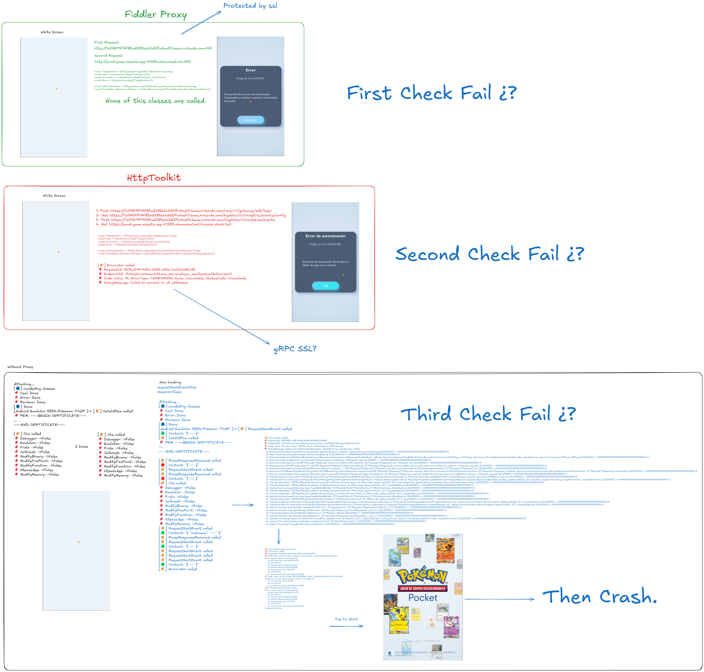

# 📦 PkmTCGPocket Packet Capture (Experimental)

**UPDATE – Capturing Packets from PkmTCGPocket**

I’ve been experimenting with bypassing some of the security checks in _PkmTCGPocket_ in an attempt to inspect the network traffic, inspired by RustyWolf’s video. This repo documents my progress and shares the tools I’ve built so far.

> ⚠️ **DISCLAIMER:**  
> I haven’t managed to bypass SSL pinning or tamper with encrypted traffic directly. What I _have_ accomplished is capturing packets **after** integrity checks are passed – so this is purely for **observational** purposes.  
> I'm not attempting to create private servers or exploit the game maliciously.

---

## 🧠 What This Does

- Hooks into the app using **Frida**, after the app passes its integrity checks.
- Intercepts communication by hooking into both a `sender` and an `observer`.
- Captures packet data and forwards it through a **WebSocket server**.
- Visualizes the data in a **frontend app made with Vite**.
- All code is in **Spanish/English mix** (Spanish is my native language), and still quite messy – but functional.

---

## 📸 Visual Reference

Check the diagram where I theorize which security mechanisms are being used.  
Also, there’s a video showing the tool in action.

<video src="media/demo.mp4" controls width="30%"></video>

---



---

## 🧪 How to Use It

Here’s the step-by-step workflow to replicate the packet capture:

1. 🖥 **Start the frontend**  
   Run the Vite app locally to prepare for WebSocket data display.

2. 📱 **Start Frida server**  
   On your device/emulator, launch the Frida server (make sure it’s properly rooted or hooked).

3. 🕹 **Launch the PkmTCGPocket app**  
   Just run the app.

4. 🧬 **Start the WebSocket server**

   ```bash
   python frida_server.py
   ```

   This injects the `agent.js` into the app via Frida and starts relaying traffic.

5. 🔄 **Reload the frontend page**  
   This will trigger the WebSocket connection and prepare it to receive data.

6. 👉 **Tap to Start**  
   Once you interact with the app, packet data should begin to stream in real-time.

7. 🧾 **Observe the traffic**  
   You can now inspect the packets, including the request that returns your card collection.

---

## 🎯 Why I Did This

My only intention was to view my card data and (eventually) build a **Mew tracker**.  
This tool is for analysis and experimentation only — _not_ for cheating or exploit hunting.

> If you’re a developer and have cleaner or better approaches, **pull requests are very welcome**!

---

## ⚙️ Requirements

- [Frida](https://frida.re/) running on device/emulator
- Node.js (For the frontend)
- Python (For the WebSocket server)
- Basic understanding of app hooking / reverse engineering

---

## 💬 Final Thoughts

This project is still very early-stage and experimental.  
I don’t fully understand the internal flow of the app or the exact functions being triggered.  
But I hope this helps others explore the possibilities of analyzing PkmTCGPocket.

Let’s see what third-party tools the community can create!

— _Saludos!_ 👋
